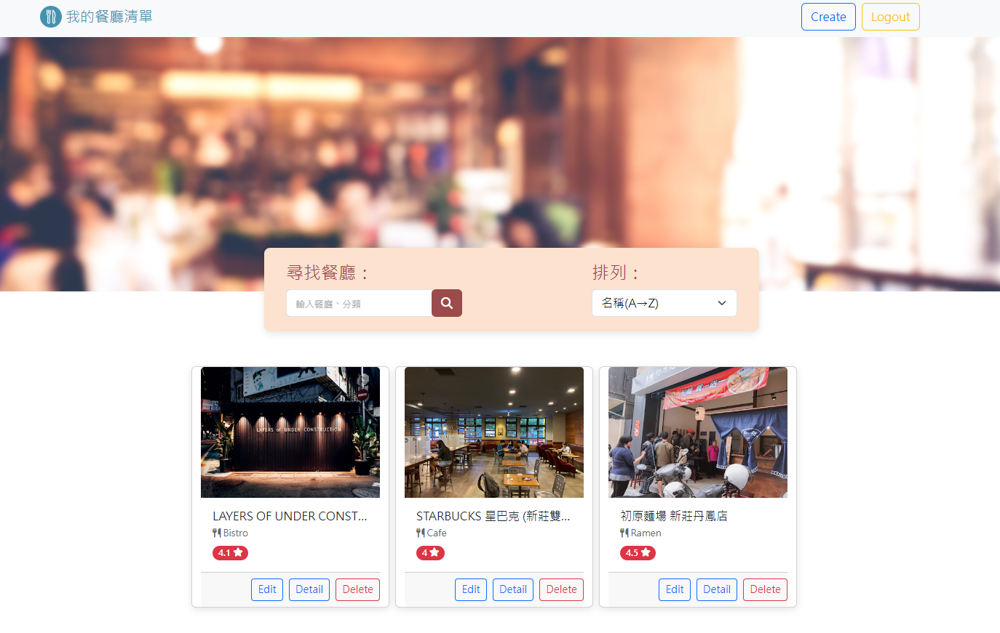

# 我的餐廳清單

## 功能
+ 使用者能夠建立帳號，建立屬於自己的口袋清單。
+ 使用者針對餐廳做出評分。
+ 使用者能夠搜尋指定餐廳。
+ 使用者能透過圖文並茂的介紹，快速理解該餐廳特色。
+ 使用者能透過網頁提供的餐廳電話及地址，進一步與店家聯繫。
+ 使用者能夠修改、刪除餐廳清單。
+ 使用者能從下拉式選單，選取不同的資料排列方式。

## 環境建置與相關套件
1. Node.js
2. npm(Node Package Manager)

## 專案安裝與執行步驟
1. 請先確認「環境建置與需求」第1點及第2點提及的程式皆已安裝。
2. 將此專案clone到本地。
3. 開啟終端機，在專案資料夾執行：
```
cd file path  #專案資料夾路徑
npm init -y 
```
4. 接著在終端機安裝套件(請見package.json的dependencies和devDependencies)：
```
# "express": "^4.16.4",
npm install express@4.16.4
```
5. 在目標資料夾新增名稱為**.env**的檔案，並自行設定相關私密資訊到內文中。
```
MONGODB_URI=<您的MongoDB URI>
FACEBOOK_ID=<您的Facebook專案ID>
FACEBOOK_SECRET=<您的Facebook專案密碼>
FACEBOOK_CALLBACK=<您的Facebook專案CALLBACK網址>
SESSION_SECRET=<您的SESSION設定>
PORT=<您的PORT>
```

6. 在終端機啟動伺服器。
```
npm run start (node app.js)
npm run dev (nodemon app.js)
```
7. 在瀏覽器輸入http://localhost:3000，即可連線。

8. 將測試資料json資料載入到資料庫。
```
npm run seed
```